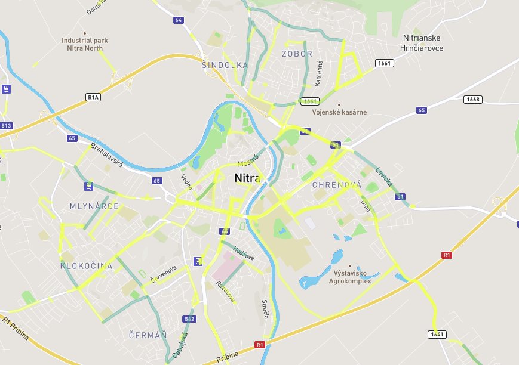
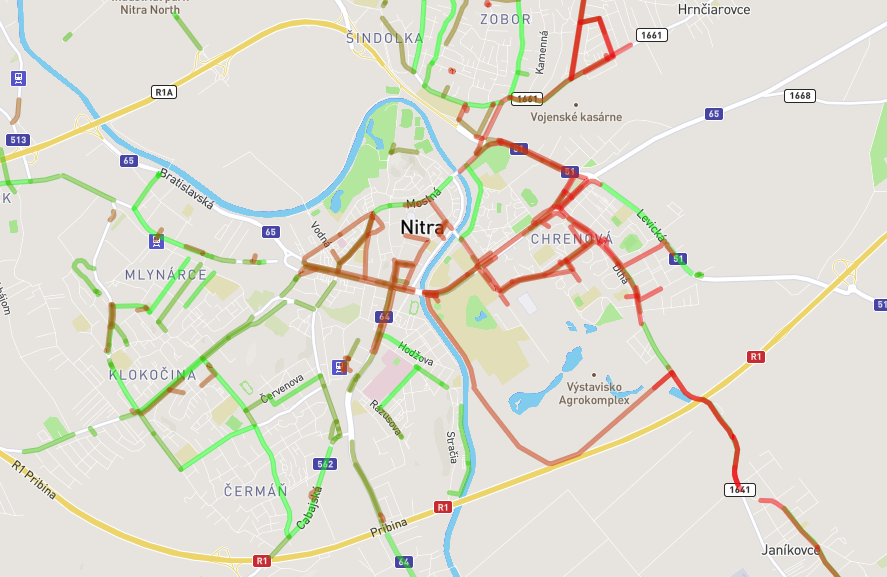

# Overview - Find your paradise

This application shows streets and squares or certain item in selected part of Slovakia on a map. Most important features are:
- searching certain place in certain area (using fulltext search methods, finding points/lines/polygons)
- showing the best streets for selected criteria (children friendly, near to public transportation, sport opportunities, night life opportunities, tourism)
- by default - highlights also especially good streets based on the criteria 
- showing selected streets in different colors from red to green - from the worst to the best ones 

Classic view of the best streets (yellow ones, the best of yellows ones are green) for public transportation in Nitra:


Gradient view of the best streets for night lift in Nitra:


The application has 2 separate parts, the client which is a [frontend web application](#frontend) using mapbox API and mapbox.js and the [backend application](#backend) written in [Python - cherrypy](http://cherrypy.org/), backed by PostGIS. The frontend application communicates with backend using a [REST API](#api).

# Frontend

The frontend application is a static HTML page (`index.html`), which shows a mapbox.js widget. Defaultly, it is displaying nothing more than typical map. After successful search of something (either place or for the best streets), the found line and polygons are colorfully highlighted and for points is added an icon. The color of highlighting is normally yellow and for the best results green (for example - looking for children friendly zones, it is above average to have more than two schools/parks/playgrounds... along one street, so this street is highlighted more), after checking for ordering of the streets, the colors in range from green to red. The order is made by count of all interesting items for this search along the street (for example for night life it is count of bars, pubs, theaters...).

All relevant frontend code is in `map.js` which is referenced from `index.html`. The custom style is in `style.css`. The frontend code responsibilities are:
- catching user's wishes, interaction with him
- calling the backend APIs
- showing buffering animation while backend is computing the data
- displaying the results (places, streets, squares...) by overlaying the map with a geojson layer, the geojson is provided directly by backend APIs

# Backend

The backend application is written in Python with help of Cherrypy web framework and is responsible for querying geo data, formatting the geojson and data for the map.

## Data

The origin of data is in Open Street Maps. I downloaded data covering Slovakia (around 200 MB) and imported it using the `osm2pgsql` tool into the standard OSM schema in WGS 84 with hstore enabled. In Python, I use one thread which is responsible for maintaining of the connection with Postgis database and there are also functions for starting queries. GeoJSON is generated by using a standard `st_asgeojson` function. There are used some other functions for fulltext search - creating extension, changing configuration and using vectors.

## Api

**Find streets near public transportation platforms in Nitra in order to show them in gradient colors**

`GET http://127.0.0.1:8099/public_transport?location=Nitra&gradient=true`

**Find Lidl in area of Nitra**

`GET http://127.0.0.1:8099/find_in?location=Nitra&place=Lidl`

### Response

In the second casemm, API calls return json responses with 2 top-level keys, `name` and `geojson`. `geojson` contains a location of the item. The response of calling for streets near public transportation would be not including name, but count of public transportation platforms in the short distance.
```
[[{"name": "Lidl", "st_asgeojson": "{\"type\":\"Point\",\"coordinates\":[18.0823862,48.3134511]}"}], [{"name": "Lidl", "st_asgeojson": "{\"type\":\"Point\",\"coordinates\":[18.0826821,48.3131445]}"}], [{"name": "Lidl", "st_asgeojson": "{\"type\":\"Polygon\",\"coordinates\":[[[18.0621009,48.3013497],[18.0623587,48.301494],[18.0624099,48.3015227],[18.0625616,48.301403],[18.0625182,48.301379],[18.0625105,48.301374],[18.0629197,48.3010529],[18.0627798,48.3009736],[18.0627912,48.3009641],[18.0627611,48.3009464],[18.0628019,48.300915],[18.0627159,48.300866],[18.0621009,48.3013497]]]}"}], [{"name": "Lidl", "st_asgeojson": "{\"type\":\"Polygon\",\"coordinates\":[[[18.1086306,48.3094881],[18.1089596,48.309661],[18.1095478,48.3091582],[18.1094605,48.3091125],[18.1094221,48.3091441],[18.1093872,48.3091263],[18.1093752,48.3091369],[18.1092209,48.3090555],[18.1088319,48.3093881],[18.1087797,48.3093602],[18.1086491,48.3094723],[18.1086306,48.3094881]]]}"}]]
```
